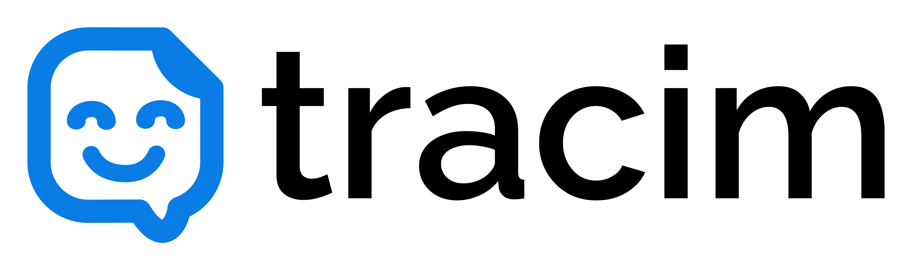

# Tracim



## Description

Unified platform for seamless collaboration.   
No matter when you work!   
[Tracim](https://www.tracim-teamwork.com/en/index.html) enables optimal team collaboration right from the start.

### 🧐 Features
Tracim offers the essential features you need for efficient, intuitive and multi-device team and project collaboration:

- Share and version files
- Communicate with your team
- Manage tasks and projets, organized in spaces
- Multilingual:  Arabic, English, French, German and Portuguese

No more missed messages. Just one place to plan, create and succeed together.   
It’s not just chat, drive and visio — it also includes knowledge, documentation, project management, logbooks,
templates ... all organized.

Learn more at https://www.tracim-teamwork.com/

### Project information:

- 📄 Tracim is distributed under the terms of 4 distinct licenses. See [LICENSE.md](LICENSE.md) for details.
- 🛠️ Tech stack: Python, React, PostgreSQL
- [Roadmap](https://github.com/tracim/tracim/projects?query=is%3Aopen)
- [Changelog](CHANGELOG.md)

## Getting started

### Using our free online service

Try Tracim using the [online demo](https://demo.tracim.fr/ui/login).

### Locally using Docker

If you prefer to test Tracim on your own infrastructure, then you can use Docker with the [Tracim Docker image](https://hub.docker.com/r/algoo/tracim/).

> [!important]
> Docker images for the latest Tracim versions are only available to our paying customers.

Launch using:

```bash
mkdir -p ~/tracim/etc
mkdir -p ~/tracim/var
docker run \
    -e DATABASE_TYPE=sqlite \
    -e TRACIM_WEBSITE__BASE_URL=http://{ip_address}:{port} \
    -p {port}:80 \
    -v ~/tracim/etc:/etc/tracim \
    -v ~/tracim/var:/var/tracim \
    algoo/tracim:latest
```

> [!note]
> Application will be accessible at `http://{ip_address}:{port}`
> Default credentials will be:
> - email: `admin@admin.admin`
> - password: `admin@admin.admin`

## Getting help

Multiple subscriptions plans are available to get professional support, including a free plan for families or individual
uses, even non-profit organizations.     
Check our [irresistible packages](https://www.tracim-teamwork.com/en/packages.html) !

For non-paying users, community support is available:

- [Read the user documentation](https://public-community.tracim.fr/ui/workspaces/180/contents): Learn how to use Tracim with our quick
  start guide.
- [Public Technical documentation](docs/)
- [Join the community forum](https://public-community.tracim.fr/ui/workspaces/157/contents): Facing an issue? Reach out to the
  community for help!

## Contributing

Contributions are much welcome, whether to translations, helping others on the forum or code !

Please check the [contribution guide](CONTRIBUTING.md).

## Author

Tracim is developed with ❤️ by [Algoo](https://www.algoo.fr/), a French company deeply rooted in open source software.

## ❤️ Project support


[Weblate](https://weblate.org) is an open source translation service, they are helping us to translate Tracim by
providing a hosting service.


[BrowserStack](https://www.browserstack.com) supports open source projects, and graciously helps us to test Tracim on
every device.
