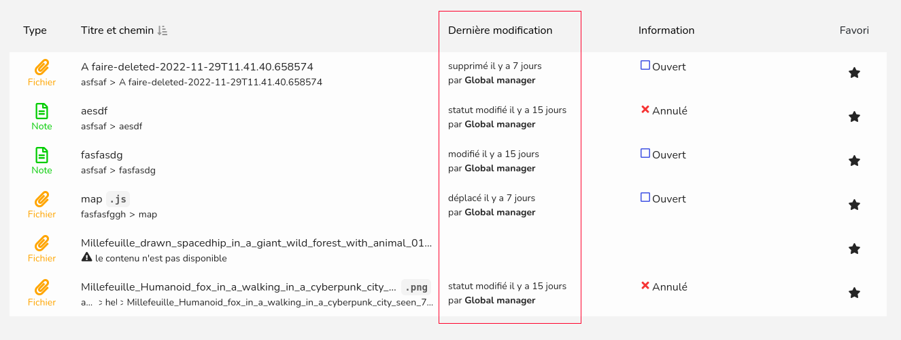

# Tables and columns in Tracim

Table and columns in Tracim are a new way of coding and rendering tables and listings
for Tracim. It contributes to a more consistent interface in Tracim.

For developers, it provides an easier way to design tables. 
It is designed to reduce development time,
since columns are designed to be reusable in different tables. 
It also removes the necessity to implement
per table sorting and filtering, since it is managed by the columns.

It also drastically reduces the code size for pages. Since the rendering, filtering and sorting
of the data is managed by the tables and columns.


## Table of contents

* [Columns](#columns)
  + [How to create a new column](#how-to-create-a-new-column)
    - [Step 1](#step-1)
    - [Step 2](#step-2)
    - [Step 3](#step-3)
    - [Step 4](#step-4)
    - [Step 5](#step-5)
    - [Step 6 (Optional)](#step-6--optional-)
    - [Step 7 (Optional)](#step-7--optional-)
    - [Conclusion](#conclusion)
* [Tables](#tables)
  + [How to create a new table](#how-to-create-a-new-table)
    - [Step 1](#step-1-1)
    - [Step 2](#step-2-1)
    - [Step 3](#step-3-1)
  + [Props](#props)
* [Example](#example)
  + [Column](#column)
  + [Table](#table)
  + [Result](#result)


## Columns

A column is a core element of the `TracimTable`, it is the only way to render the table's data.

The column is similar to a React Component, but it's not a React Component.
A column needs to be stored in `frontend_lib/src/columns`

A column should be designed to be reusable in different tables.
(As long as the input data matches the expected format)

### How to create a new column

For this example we will use the following data format:

```json
{
  "status": "online",
  "username": "xXJohnXx",
  "firstName": "John",
  "lastName": "Doe",
  "age": 25
}
```

---

#### Step 1

Create a column function and set it to receive a mandatory argument: `settings`.

```javascript
const myColumn = (settings) => {}
```

`settings` is an object containing data used in the column. It features the following fields:

- `header`: Text that should be displayed in the header.
- `tooltip`: Text that should be used as the header's tooltip.
- `className`: The classes that should be applied to each cell of the column.
- `id`: The id of the column, must be unique
- `style`: An array of styles brought by the STYLE constant.

Additional arguments can be added after settings.

---

#### Step 2

Create its columnHelper with the relevant imported function.

```javascript
import { createColumnHelper } from '@tanstack/react-table'

const myColumn = (settings) => {
  const columnHelper = createColumnHelper()
}
```

For more information about this function refer to the library's documentation on 
[tanstack.com](https://tanstack.com/).

---

#### Step 3

Define the various required sections of a column:

- `header`: The header of the column
- `id`: The id of the column, must be unique
- `cell`: How the cell will be rendered.
- `style`: Styles applied from the STYLE constant.
- `className`: The custom classes applied to its cells and header.
  It's value must include the `settings.className` argument.

```javascript
import { createColumnHelper } from '@tanstack/react-table'
import classnames from 'classnames'

const usernameColumn = (settings) => {
  const columnHelper = createColumnHelper()
  return columnHelper.accessor(row => row.username, {
    header: () => '',
    id: settings.id,
    cell: props => '',
    style: classnames(settings.style),
    className: settings.className
  })
}
```

The `row => row.username` accessor function is used to choose which data 
will be passed to the filter function.
Its return value needs to be set to a primitive for this feature to work.
(e.g. `row => row.username`).

Preprocessing complex data to output a primitive should be considered.
(e.g. ``row => `${row.firstName} ${row.lastName}` ``)

This however brings limitations for the sorting and filtering functions, 
it is still possible to circumvent this limitation. 
(e.g. serializing the JSON to a string, and deserialize it in the filter function).

---

#### Step 4

For now the column renders an empty header and cell. It's time to define a proper header.

```javascript
import { createColumnHelper } from '@tanstack/react-table'

const usernameColumn = (settings) => {
  const columnHelper = createColumnHelper()
  return columnHelper.accessor(row => row.username, {
    header: () => (
      <span>{settings.header}</span>
    ),
    id: settings.id,
    cell: props => '',
    style: classnames(settings.style),
    className: settings.className
  })
}
```

`header` is similar to a React Function Component, it's a function that has to return `HTML` code.

---

#### Step 5

Now Define how the cell will be rendered.

The row's data is accessible through `props.getValue()`, which returns what is defined in
the accessor function.

```javascript
import { createColumnHelper } from '@tanstack/react-table'

const usernameColumn = (settings) => {
  const columnHelper = createColumnHelper()
  return columnHelper.accessor(row => row.username, {
    header: props => (
      <TitleListHeader
        title={settings.header}
        onClickTitle={() => props.onClickTitle(SORT_BY.LABEL)}
        customClass='table__customClass'
        isOrderAscending={props.isOrderAscending}
        isSelected={props.selectedSortCriterion === SORT_BY.LABEL}
        tootltip={settings.tooltip}
      />
    ),
    id: settings.id,
    cell: props => (
      <span>{`Hello ${props.row.original.username}, how are you?`}</span>
    ),
    style: classnames(settings.style),
    className: settings.className
  })
}
```
The row's data is stored in `props.row.original`.

Like `header`, `cell` is similar to a React Function Component.

---

#### Step 6 (Optional)

If the accessor is properly set, the column will be filterable by default.

The appropriate filter function will be automatically chosen from the built-in filters.
however it is preferable to specify it in the `filterFn` field to avoid any unexpected behavior.

The list of built-in filter functions can be found on 
[tanstack.com](https://tanstack.com/table/v8/docs/api/features/filters#filter-functions).

```javascript
import { createColumnHelper } from '@tanstack/react-table'

const usernameColumn = (settings) => {
  const columnHelper = createColumnHelper()
  return columnHelper.accessor(row => row.username, {
    header: props => (
      <TitleListHeader
        title={settings.header}
        onClickTitle={() => props.onClickTitle(SORT_BY.LABEL)}
        customClass='table__customClass'
        isOrderAscending={props.isOrderAscending}
        isSelected={props.selectedSortCriterion === SORT_BY.LABEL}
        tootltip={settings.tooltip}
      />
    ),
    id: settings.id,
    cell: props => (
      <span>{`${props.translate('Hello')} ${props.getValue().username}`}</span>
    ),
    style: classnames(settings.style),
    className: settings.className,
    filterFn: 'includesString'
  })
}
```

Instead of using a built-in, it is possible to set it to a custom filter function
instead of the built-in's string.

Here is the signature of a filter function:
```javascript
FilterFn = (row, columnId, filterValue) => boolean
```

The first parameter is react-table's `Row` object, the second is the column's id.
The accessor function is callable through `row.getValue(columnId)`, this calls the column's accessor function.

The third parameter is the filter value, it is the value that the user typed in the filter input.

It has to return a boolean, false to filter out, true to filter in.

---

#### Step 7 (Optional)

If the accessor is properly set, the column will be sortable by default.

The appropriate sorting function will be automatically chosen from the built-ins.
however it is preferable to specify it in the `sortingFn` field to avoid any unexpected behavior.

The list of built-in filter functions can be found on
[tanstack.com](https://tanstack.com/table/v8/docs/api/features/sorting#sorting-functions).

```javascript
import { createColumnHelper } from '@tanstack/react-table'

const usernameColumn = (settings) => {
  const columnHelper = createColumnHelper()
  return columnHelper.accessor(row => row.username, {
    header: props => (
      <TitleListHeader
        title={settings.header}
        onClickTitle={() => props.onClickTitle(SORT_BY.LABEL)}
        customClass='table__customClass'
        isOrderAscending={props.isOrderAscending}
        isSelected={props.selectedSortCriterion === SORT_BY.LABEL}
        tootltip={settings.tooltip}
      />
    ),
    id: settings.id,
    cell: props => (
      <span>{`${props.translate('Hello')} ${props.getValue().username}`}</span>
    ),
    className: settings.className,
    style: classnames(settings.style),
    filterFn: 'includesString',
    sortingFn: 'alphanumeric'
  })
}
```

Instead of using a built-in, it is possible to set it to a custom filter function
instead of the built-in's string.

Here is the signature of a filter function:
```javascript
SortingFn = (rowA, rowB, columnId) => number
```

The first parameter is react-table's `Row` object, the second is another row to compare against.
The third parameter is the columnId.

The accessor function is callable through `row.getValue(columnId)`, this calls the column's accessor function.

It has to return `-1` if `a < b`, `0` if `a === b`, `1` if `a > b`.

---

#### Conclusion

Here is a complete column. It's filterable, sortable, has a header and a cell and
can now be used it in tables!

## Tables

A table or a listing is a container rendering the `TracimTable` component 
(`frontend_lib/src/component/TracimTable/TracimTable.jsx`).

The `TracimTable` manages the rendering, filtering, and sorting of the data.

###  How to create a new table

A table is somewhat like a container of the `TracimTable` component, 
it manages which data and columns should be rendered, along with multiple optional parameters 
that can be tweaked through the props.

---

#### Step 1

A table will usually get its data, an array of similarly formatted data, from its props.
It will also need the "user" props, usually passed by redux.

```javascript
const myTable = (props) => {}

myTable.propsType = {
  myData: PropTypes.array.isRequired,
  user: PropTypes.object.isRequired
}
```

---

#### Step 2

Set the displayed columns in an array, note that the columns will be displayed 
in the order of the array, left to right.

```javascript
const myTable = props => {
  const columns = [
    column1(),
    column2()
  ]
}

myTable.propsType = {
  myData: PropTypes.array.isRequired,
  user: PropTypes.object.isRequired
}
```

---

#### Step 3

Finally, render the `TracimTable` component with the data, columns and user props:

```javascript
const myTable = (props) => {
  const columns = [
    column1(stuff),
    column2(otherStuff)
  ]

  return (
    <TracimTable
      data={props.myData}
      columns={columns}
      user={props.user}
    />
  )
}

myTable.propsType = {
  myData: PropTypes.array.isRequired,
  user: PropTypes.object.isRequired
}
```

(Additional props can be passed to `TracimTable`. We will see these in the 
[table props section](#props))

Now the `TracimTable` will automatically render the column headers, 
and a row per entry in the data array.

---

### Props

The `TracimTable` is highly configurable through its props. Here is an exhaustive list:

| Name                | Type                   | Required ? | Default Value        | Definition                                                                                                                                                                     |
|---------------------|------------------------|------------|----------------------|--------------------------------------------------------------------------------------------------------------------------------------------------------------------------------|
| columns             | Array                  | Yes        | N/A                  | An array of columns, defines (in the order of the array) which columns will be rendered in the table.                                                                          |
| data                | Array                  | Yes        | N/A                  | The data used to render the table, an entry is a row.                                                                                                                          |
| showHeader          | Bool                   | No         | true                 | Set to false to skip the headers rendering.                                                                                                                                    |
| colored             | Bool                   | No         | false                | Set to true to set a different background-color for even rows, creating an alternating pattern, easier to discern each row in some tables.                                     |
| emptyMessage        | String                 | No         | 'This list is empty' | The message to display when the table has no data. Note that it is not related to the message displayed when filtering.                                                        |
| rowComponent        | Func (React Component) | No         | none                 | A custom component for the lines, in order to apply code logic to row level (As in content listings for example).                                                              |
| customRowClass      | String                 | No         | ''                   | A custom class applied to each and every row.                                                                                                                                  |
| filterable          | Bool                   | No         | false                | Set to true to enable filtering for the table, the filter bar will be rendered accordingly. Filtering rules are defined in the columns. The table manages filtering by itself. |
| filterPlaceholder   | String                 | No         | 'Filter this list'   | The placeholder to put in the filter bar's input field.                                                                                                                        |
| sortable            | Bool                   | No         | false                | Set to true to enable sorting for the table, the sorting parameters are defined in each columns. The table manages sorting by itself.                                          |
| defaultSortColumnId | String                 | No         | undefined            | The default columnId on which the table should sort it's data                                                                                                                  |


## Example

Here is an example of a table and a column in Tracim.

The shown code is the code of the `FavoritesTable` and the `Last Modification` column.

### Column

```javascript
import React from 'react'
import classnames from 'classnames'
import { createColumnHelper } from '@tanstack/react-table'

import { getRevisionTypeLabel } from '../../helper.js'

import TimedEvent from '../../component/TimedEvent/TimedEvent.jsx'

const timedEventColumn = (settings, lang, t) => {
  const columnHelper = createColumnHelper()
  return columnHelper.accessor(row => {
    if (!row.content || !row.content.lastModifier) return ''
    return `${row.content.modified} ${row.content.lastModifier.publicName}`
  }, {
    header: () => (
      <span>{settings.header}</span>
    ),
    id: settings.id,
    cell: props => {
      if (!props.row.original.content) return null

      return (
        <TimedEvent
          customClass='timedEventColumn__modification'
          operation={getRevisionTypeLabel(props.row.original.content.currentRevisionType, t)}
          date={props.row.original.content.modified}
          lang={lang}
          author={props.row.original.content.lastModifier}
        />
      )
    },
    className: settings.className,
    style: classnames(settings.style),
    filterFn: 'includesString',
    sortingFn: 'alphanumeric'
  })
}

export default timedEventColumn
```

### Table

```javascript
import React from 'react'
import PropTypes from 'prop-types'
import { connect } from 'react-redux'
import { translate } from 'react-i18next'

import FavoriteRowComponent from './FavoriteRowComponent.jsx'

import {
  tracimTableLib
} from 'tracim_frontend_lib'

require('./FavoritesTable.styl')

const { TracimTable, Columns, STYLE } = tracimTableLib

const FavoritesTable = (props) => {
  const columns = [
    Columns.content.contentTypeColumn({
      header: props.t('Type'),
      tooltip: props.t('Sort by type'),
      style: [STYLE.width.icon],
      id: 'type'
    }, props.contentType, props.t),

    Columns.content.contentFilenameWithBadgesAndBreadcrumbsColumn({
      header: props.t('Title and path'),
      tooltip: props.t('Sort by title'),
      style: [STYLE.flex.four],
      id: 'titleWithPath'
    }, props.t),

    Columns.timedEventColumn({
      header: props.t('Last Modification'),
      tooltip: props.t('Sort by last modification'),
      style: [STYLE.flex.two, STYLE.hiddenAt.md],
      id: 'lastModification'
    }, props.user.lang, props.t),

    Columns.content.contentStatusColumn({
      header: props.t('Information'),
      tooltip: props.t('Sort by information'),
      style: [STYLE.flex.two, STYLE.hiddenAt.md],
      id: 'information'
    }, props.contentType, props.t),

    Columns.favoriteButtonColumn({
      header: props.t('Favorite'),
      style: [STYLE.width.icon],
      id: 'favoriteButton'
    }, props.onFavoriteButtonClick)
  ]

  return (
    <TracimTable
      columns={columns}
      data={props.favoriteList}
      emptyMessage={props.t('You did not add any content as favorite yet.')}
      rowComponent={FavoriteRowComponent}
      sortable
      filterable
      filterPlaceholder={props.t('Filter my favorites')}
      defaultSortColumnId='titleWithPath'
    />
  )
}

FavoritesTable.propsType = {
  favoriteList: PropTypes.array.isRequired,
  onFavoriteButtonClick: PropTypes.func.isRequired
}

const mapStateToProps = ({ contentType, user }) => ({ contentType, user })

export default connect(mapStateToProps)(translate()(FavoritesTable))
```

### Result


